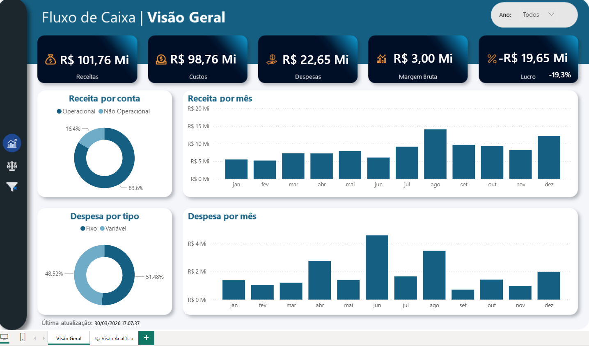
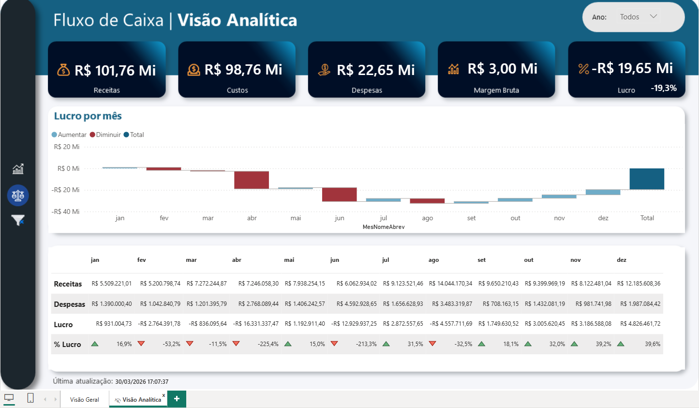

# 📊 Cash Flow Dashboard

## 📌 Overview
This project presents a cash flow analysis dashboard developed in Power BI, focusing on revenue, costs, expenses, and profitability over time.

## 📁 Dataset
- Source: Course dataset
- Format: Excel

## 🎯 Objectives
- Analyze revenue, costs, and expenses
- Monitor monthly cash flow performance
- Evaluate profitability and margins
- Identify trends and financial patterns over time

## 🛠 Tools Used
- Power BI
- Excel

## 📊 Dashboard Structure

### 📈 Overview Page
- Total revenue, costs, expenses, and profit indicators
- Revenue by month
- Expense by month
- Revenue breakdown (operational vs non-operational)
- Expense breakdown (fixed vs variable)

### 🔍 Analytical View
- Monthly profit analysis (increase vs decrease)
- Detailed financial table (revenue, expenses, profit, and % profit)
- Time-based filtering (year)

## 📊 Dashboard Preview

## 📈 Key Insights
- Despite high revenue, profit is negative, indicating high operational costs
- Certain months show significant drops in profitability
- Expenses have a strong impact on overall financial performance
- Profitability varies considerably throughout the year

## 📚 What I Learned
- Building financial dashboards in Power BI
- Analyzing cash flow and profitability metrics
- Creating multi-page reports with different analytical perspectives
- Using visuals to highlight financial trends and insights
